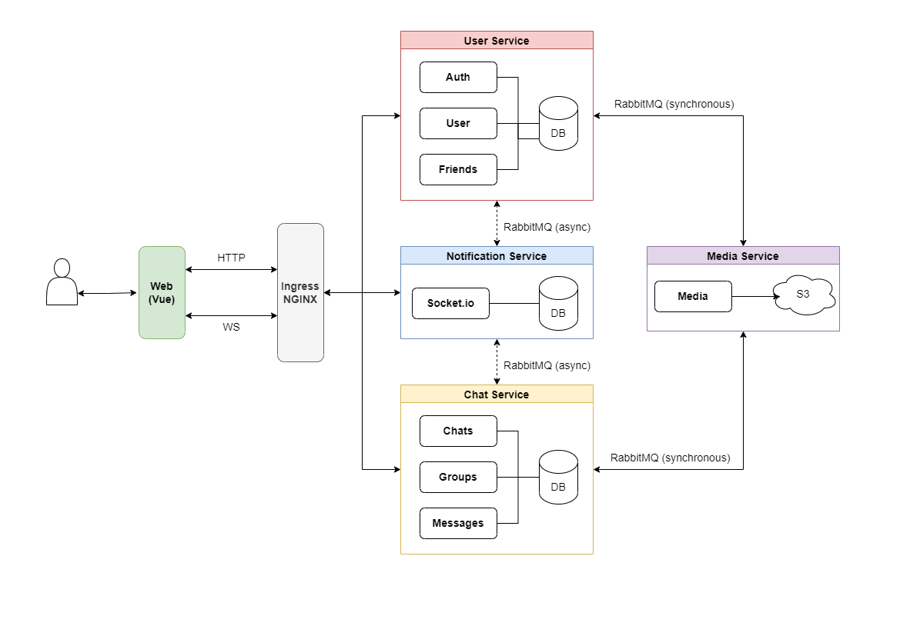

# Signal

Signal is a simple chat app that allows you to chat with your friends and groups.

The app is build using [NestJS](https://nestjs.com/) and [Vue](https://vuejs.org/).

## Stack

For more information about each component take a look at their README's.

- [Web](/web/): The Vue client.
- [App](/app/): The Android client

## Features

- Account System & Session Authentication
- Friend System [Requests & Friends]
- CRUD Chats & Groups
- CRU* Messages (with image upload)
- Realtime Events for all systems

# Server - Microservice Architecture

The server written using [TypeScript](https://www.typescriptlang.org/) and [NestJS](https://nestjs.com/) using different microservices.
The microservices communicate mostly asynchroniously using [RabbitMQ](https://www.rabbitmq.com/) and run independently of each other (with the exception of the `Media Service`).



# Stack

- [NestJS](https://nestjs.com/) for the REST server
- [MikroORM](https://mikro-orm.io/) as the database ORM
- PostgreSQL
- JWT cookie session for authentication
- [ESLint](https://eslint.org/) for linting
- [Yup](https://github.com/jquense/yup) for validation
- [Sharp](https://sharp.pixelplumbing.com/) for image resizing
- [S3](https://aws.amazon.com/s3/) for storing the files
- [RabbitMQ](https://www.rabbitmq.com/) as the message broker

# Services
- [Chat](/chat-service/): Includes actions related to chats, groups and messages
- [Common](/common/): An NPM library containing shared logic
- [Infra](/infra/): Kubernetes deployment files
- [Media](/media-service/): Includes actions related to file management using S3
- [Notification](/notification-service/): Includes actions related to all websocket events
- [User](/user-service/): Includes actions related to authentication and friends

# Installation

1. Install Docker and Kubernetes
2. Install [Skaffold](https://skaffold.dev/)
3. Generate secrets used by the different services
   ```bash
   $ kubectl apply -f https://raw.githubusercontent.com/kubernetes/ingress-nginx/controller-v1.3.1/deploy/static/provider/cloud/deploy.yaml
   $ kubectl create secret generic session-secret --from-literal=SESSION_SECRET=session
   $ kubectl create secret generic secret-access --from-literal=AWS_SECRET_ACCESS_KEY=secret-access-key
   $ kubectl create secret generic s3-region --from-literal=AWS_S3_REGION=region
   $ kubectl create secret generic bucket-name --from-literal=AWS_STORAGE_BUCKET_NAME=bucket
   $ kubectl create secret generic aws-access --from-literal=AWS_ACCESS_KEY=access-key
   ```
4. Add `signal.io` to your host file (`C:\Windows\System32\Drivers\etc\hosts` on Windows, `/etc/hosts` on MacOS/Linux)
5. Run `skaffold dev` to start the cluster
6. Go to `signal.io` to see the website

# Testing
The server uses both unit tests and E2E tests.

### Unit Tests
1. Run the tests
   ```bash
   $ cd `service name`
   $ pnpm test
   ```
   
### E2E Tests
1. Create a test DB using PostgreSQL
   ```bash
   $ docker run --name postgres -p 5432:5432 -e POSTGRES_USER=root -e POSTGRES_PASSWORD=password -d postgres:alpine
   $ docker exec -it postgres createdb --username=root --owner=root signal_test
   ```
2. Have the DB running
3. Run the tests
   ```bash
   $ cd `service name`
   $ pnpm test:e2e
   ```

## Reference Architecture

- https://www.karanpratapsingh.com/courses/system-design/whatsapp
- Stephen Grider's [Microservices with Node JS and React](https://www.udemy.com/course/microservices-with-node-js-and-react/)